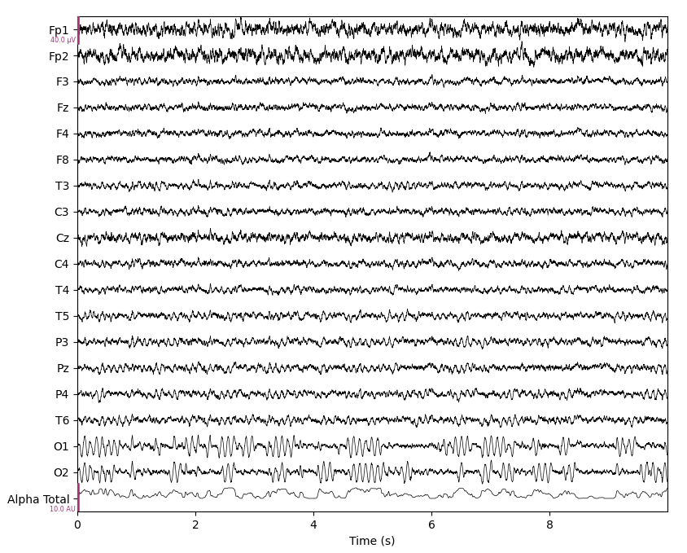

# Simulator for Eyes-Closed EEG

## General

This python code simulates EEG in an eyes-closed scenario (patient has their eyes closed).
There are 32 channel according to the standard 10-20 system, plus one additional channel that shows the amount of alpha waves in the recording.

## Details

The data is created for a 500 Hz setup, each channel contains an Ornstein-Uhlenbeck process (coloured noise), with added alpha (sine at 10 Hz).
The eeg intensity for Fp1 and Fp2, as well as Cz is a bit higher than in the other channels.
Alpha intensity for occipital channels (O1, O2) is high, for neighbouring channels significantly lower, central and frontal channels have no alpha.

## Performance

The system is intended to simulate a realtime recording and export via LSL, to test eego display and/or analysis.
On my laptop (2GHz) 10 seconds of EEG data at 500 Hz sampling rate are created in 3 seconds.
